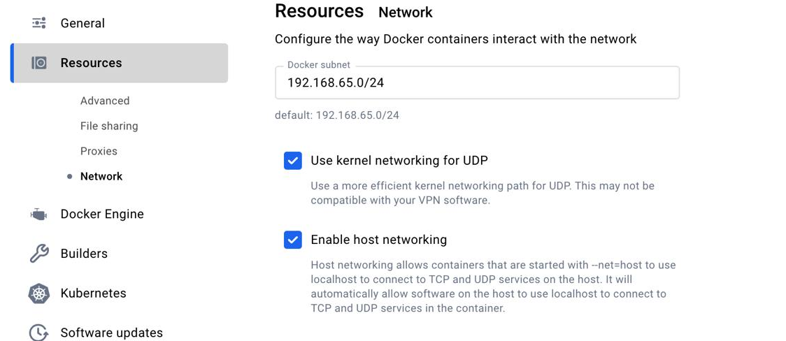

# End-to-End Test Environment

> [WARNING‼️]  
> 🏗️ Under construction!

## Contents

```sh
.
├── README.md
├── configs                 # Configurations for test networks
└── scripts                 # Helper scripts for interacting with the network
```

## Pre-requisites

- [Kurtosis](https://docs.kurtosis.com/install): For launching test networks
- [Bun](https://bun.sh/): TypeScript runtime and package manager
- [Docker](https://www.docker.com/): For container management

## QuickStart

Run: `bun start:e2e:minimal`

## Manual Deployment

Follow these steps to set up and interact with your test environment:

1. **Deploy a minimal test environment**

   ```bash
   bun start:e2e:minimal
   ```

2. **Explore the network**

   - Block Explorer: [http://localhost:3000](http://localhost:3000).
   - Kurtosis Dashboard: Run `kurtosis web` to access. From it you can see all the services running in the network, as well as their ports, status and logs.

3. **Send test transactions**

   ```bash
   bun script:send-txs
   ```

4. **Deploy and verify contracts**

   ```bash
   bun script:deploy-contracts
   ```

## Network Management

- **Stop the test environment**

  ```bash
  bun stop:e2e:minimal
  ```

- **Stop the Kurtosis engine completely**

  ```bash
  bun stop:kurtosis-engine
  ```

## Troubleshooting

### E2E Network Launch doesn't work

#### Errors with deploying forge scripts on kurtosis network

Try running `forge clean` to clear any spurious build artefacts, and running forge build again. Also try deploying manually to the still running kurtosis network.

#### Blockscout is empty

If you look at the browser console, if you see the following:

```browser
Content-Security-Policy: The page’s settings blocked the loading of a resource (connect-src) at http://127.0.0.1:3000/node-api/proxy/api/v2/stats because it violates the following directive: “connect-src ' ...
```

this is a result of CORS and CSP errors due to running this as a local docker network.

Consider installing a browser addon such as [anti-CORS / anti-CSP](https://chromewebstore.google.com/detail/anti-cors-anti-csp/fcbmpcbjjphnaohicmhefjihollidgkp) to circumvent this problem.

#### Linux: See if disabling ipV6 helps

I have found that ipV6 on Arch Linux does not play very nicely with Kurtosis networks. Disabling it completely fixed the issue for me.

#### macOS: Verify Docker networking settings



If using Docker Desktop, make sure settings have permissive networking enabled.

## Further Information

- [Kurtosis](https://docs.kurtosis.com/): Used for launching a full Ethereum network
- [Zombienet](https://paritytech.github.io/zombienet/): Used for launching a Polkadot-SDK based network
- [Bun](https://bun.sh/): TypeScript runtime and ecosystem tooling
