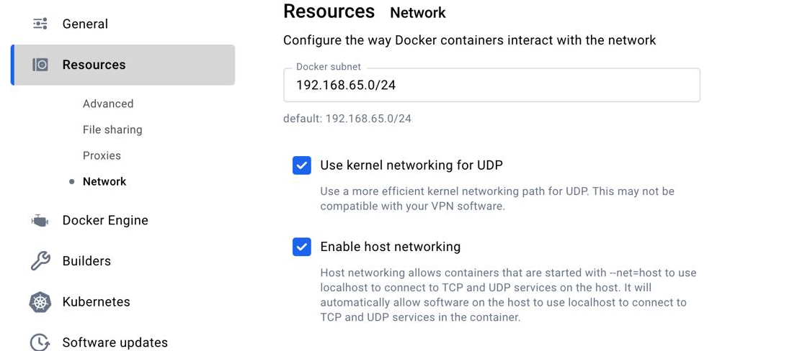

# DataHaven E2E Testing

End-to-end testing framework for DataHaven, providing automated network deployment, contract interaction, and cross-chain scenario testing. This directory contains all tools needed to launch a complete local DataHaven network with Ethereum, Snowbridge relayers, and run comprehensive integration tests.

For comprehensive documentation, see [E2E Testing Guide](./docs/E2E_TESTING_GUIDE.md).

## Pre-requisites

- [Kurtosis](https://docs.kurtosis.com/install): For launching test networks
- [Bun](https://bun.sh/) v1.3.2 or higher: TypeScript runtime and package manager
- [Docker](https://www.docker.com/): For container management
- [Foundry](https://getfoundry.sh/introduction/installation/): To deploy contracts
- [Helm](https://helm.sh/docs/intro/install/): The Kubernetes Package Manager 

#### MacOS
If you are running this on a Mac, `zig` is a pre-requisite for crossbuilding the node. Instructions for installation can be found [here](https://ziglang.org/learn/getting-started/).
You may also need to install `libpq` for PostgreSQL connectivity and set the appropriate Rust flags.

```bash
# Install libpq using Homebrew
brew install zig

# Install libpq using Homebrew
brew install libpq

# Set environment variables for Rust compilation
export PKG_CONFIG_PATH="/opt/homebrew/opt/libpq/lib/pkgconfig"
export CPPFLAGS="-I$(brew --prefix libpq)/include"
export LDFLAGS="-L$(brew --prefix libpq)/lib"
export PKG_CONFIG_PATH="$(brew --prefix libpq)/lib/pkgconfig"

# Add to your shell profile (~/.zshrc or ~/.bash_profile) to persist
echo 'export PKG_CONFIG_PATH="/opt/homebrew/opt/libpq/lib/pkgconfig"' >> ~/.zshrc
echo 'export CPPFLAGS="-I$(brew --prefix libpq)/include"' >> ~/.zshrc
echo 'export LDFLAGS="-L$(brew --prefix libpq)/lib"' >> ~/.zshrc
echo 'export PKG_CONFIG_PATH="$(brew --prefix libpq)/lib/pkgconfig"' >> ~/.zshrc
```

## Quick Start

```bash
# Install dependencies
bun i

# Interactive CLI to launch a full local DataHaven network
bun cli launch

# Run all e2e tests
bun test:e2e

# Run specific suite types (can run in parallel on CI)
bun test:e2e:datahaven    # DataHaven-only tests (no Ethereum)
bun test:e2e:storagehub   # StorageHub integration tests
bun test:e2e:ethereum     # Full cross-chain tests

# Run all the e2e tests with limited concurrency
bun test:e2e:parallel

# Run a specific test file
bun test e2e/suites/ethereum/native-token-transfer.test.ts
```

NOTES: Adding the environment variable `INJECT_CONTRACTS=true` will inject the contracts when starting the tests to speed up setup.

## AVS Owner Parameters & Tx Execution

Our deployment tooling now separates “who becomes the ServiceManager owner” from “who executes the privileged post-deployment calls.” The knobs are:

| Flag / Env | Purpose | Default |
| --- | --- | --- |
| `--avs-owner-address` / `AVS_OWNER_ADDRESS` | Address set as `avsOwner` in the ServiceManager initializer. **Required** when targeting testnet/mainnet (Safe multisig). Falls back to `config/<network>.json` only for local/anvil. | Local uses config value; non-local must supply. |
| `--avs-owner-key` / `AVS_OWNER_PRIVATE_KEY` | Private key used to sign owner-only calls the script performs (e.g. `setSlasher`). Only read when tx execution is enabled. | Anvil default key if unset. |
| `--execute-owner-transactions` (CLI) / `TX_EXECUTION=true|false` (env) | Controls whether the script actually broadcasts owner calls. When disabled, we skip sending transactions and instead print ABI-encoded payloads that a Safe can execute. | Enabled automatically for local flows and CI helpers; disabled by default on `hoodi/holesky/mainnet`. |

### Examples

```bash
# Local/anvil developer run (executes owner txs immediately)
bun cli contracts deploy --chain anvil --avs-owner-key $LOCAL_OWNER_KEY --execute-owner-transactions

# Testnet deployment where ownership is a Safe (prints multisig payloads)
AVS_OWNER_ADDRESS=0x... bun cli contracts deploy --chain hoodi

# Force execution during launch/deploy automation (already the default)
bun cli launch --deploy-contracts --execute-owner-transactions
```

When tx execution is off, the CLI prints a list of `{to, data, value}` objects for:

1. `updateAVSMetadataURI("")`
3. `setRewardsRegistry(validatorsSetId, rewardsRegistry)`
4. `setRewardsAgent(validatorsSetId, rewardsAgent)`

Copy each object into your safe transaction builder (or preferred multisig workflow) to finalize the deployment.

## Generating Ethereum state

To avoid deploying contracts everytime for each tests, you can generate and then inject state in the Ethereum client.

### Generate state

```
$ bun cli launch --all
$ make generate-ethereum-state
$ bun cli stop --all
```

## What Gets Launched

The `bun cli launch` command deploys a complete local environment:

1. **Ethereum Network** (via Kurtosis):
   - 2x Execution Layer clients (reth)
   - 2x Consensus Layer clients (lodestar)
   - Blockscout Explorer (optional: `--blockscout`)
   - Dora Consensus Explorer

2. **DataHaven Network**:
   - 2x Validator nodes (Alice & Bob) with keys (babe, grandpa, imonline, beefy)
   - EVM compatibility via Frontier
   - Fast block times (2-3s in dev mode)
   - Fast churn settings (`--fast-runtime` gives 1-minute epochs and 3-session eras while block time stays 6s)

3. **Smart Contracts**:
   - EigenLayer AVS contracts deployed to Ethereum
   - Optional Blockscout verification (`--verified`)

4. **Snowbridge Relayers**:
   - Beacon relay (Ethereum → DataHaven)
   - BEEFY relay (DataHaven → Ethereum)
   - Execution relay (Ethereum → DataHaven)
   - Solochain relay (DataHaven → Ethereum)

5. **StorageHub Components** (optional: `--storagehub`):
   - 1x MSP (Main Storage Provider) node with bcsv ecdsa key
   - 1x BSP (Backup Storage Provider) node with bcsv ecdsa key
   - 1x Indexer node with PostgreSQL database
   - 1x Fisherman node
   - Automatic provider registration via `force_msp_sign_up` / `force_bsp_sign_up`

6. **Network Configuration**:
   - Validator registration and funding
   - Parameter initialization
   - Validator set updates

For more information on the E2E testing framework, see the [E2E Testing Framework Overview](./docs/E2E_FRAMEWORK_OVERVIEW.md).

## Common Commands

| Command                   | Description                                                                                        |
| ------------------------- | -------------------------------------------------------------------------------------------------- |
| **Network Management**    |                                                                                                    |
| `bun cli`                 | Interactive CLI menu for all operations                                                            |
| `bun cli launch`          | Launch full local network (interactive options)                                                    |
| `bun cli launch --all`     | Launch all components including StorageHub                                                         |
| `bun cli launch --storagehub` | Launch with StorageHub nodes (MSP, BSP, Indexer, Fisherman)                                    |
| `bun start:e2e:local`     | Launch local network (non-interactive)                                                             |
| `bun start:e2e:verified`  | Launch with Blockscout and contract verification                                                   |
| `bun start:e2e:ci`        | CI-optimized network launch                                                                        |
| `bun cli stop`            | Stop all services (interactive)                                                                    |
| `bun stop:dh`             | Stop DataHaven only                                                                                |
| `bun stop:sb`             | Stop Snowbridge relayers only                                                                      |
| `bun stop:eth`            | Stop Ethereum network only                                                                         |
| **Testing**               |                                                                                                    |
| `bun test:e2e`            | Run all E2E test suites                                                                            |
| `bun test:e2e:datahaven`  | Run DataHaven-only tests (no Ethereum network)                                                     |
| `bun test:e2e:storagehub` | Run StorageHub integration tests                                                                   |
| `bun test:e2e:ethereum`   | Run full cross-chain Ethereum tests                                                                |
| `bun test:e2e:parallel`   | Run tests with limited concurrency                                                                 |
| `bun test <file>`         | Run specific test file                                                                             |
| **Code Generation**       |                                                                                                    |
| `bun generate:wagmi`      | Generate TypeScript contract bindings (after contract changes)                                     |
| `bun generate:types`      | Generate Polkadot-API types from runtime                                                           |
| `bun generate:types:fast` | Generate types with fast-runtime feature                                                           |
| **Code Quality**          |                                                                                                    |
| `bun fmt:fix`             | Fix TypeScript formatting with Biome                                                               |
| `bun typecheck`           | TypeScript type checking                                                                           |
| **Deployment**            |                                                                                                    |
| `bun cli deploy`          | Deploy to Kubernetes cluster (interactive)                                                         |
| `bun build:docker:operator` | Build local Docker image (`datahavenxyz/datahaven:local`)                                        |

## Local Network Deployment

Follow these steps to set up and interact with your local network:

1. **Deploy a minimal test environment**

   ```bash
   bun cli launch
   ```

   This script will:

   1. Check for required dependencies.
   2. Launch a DataHaven solochain.
   3. Start a Kurtosis network which includes:
      - 2 Ethereum Execution Layer clients (reth)
      - 2 Ethereum Consensus Layer clients (lodestar)
      - Blockscout Explorer services for EL (if enabled with --blockscout)
      - Dora Explorer service for CL
   4. Deploy DataHaven smart contracts to the Ethereum network. This can optionally include verification on Blockscout if the `--verified` flag is used (requires Blockscout to be enabled).
   5. Perform validator setup and funding operations.
   6. Set parameters in the DataHaven chain.
   7. Launch Snowbridge relayers.
   8. Perform validator set update.

   > [!NOTE]
   >
   > If you want to also have the contracts verified on Blockscout, you can pass the `--verified` flag to the `bun cli launch` command, along with the `--blockscout` flag. This will do all the previous, but also verify the contracts on Blockscout. However, note that this takes some time to complete.

2. **Explore the network**

   - Block Explorer: [http://127.0.0.1:3000](http://127.0.0.1:3000).
   - Kurtosis Dashboard: Run `kurtosis web` to access. From it you can see all the services running in the network, as well as their ports, status and logs.
   - StorageHub Nodes (if launched with `--storagehub`):
     - Alice (Validator): [ws://127.0.0.1:9944](ws://127.0.0.1:9944)
     - MSP Node: [ws://127.0.0.1:9945](ws://127.0.0.1:9945)
     - BSP Node: [ws://127.0.0.1:9946](ws://127.0.0.1:9946)
     - Indexer Node: [ws://127.0.0.1:9947](ws://127.0.0.1:9947)
     - Fisherman Node: [ws://127.0.0.1:9948](ws://127.0.0.1:9948)

## Troubleshooting

### E2E Network Launch doesn't work

#### Script halts unexpectedly

When running `bun cli launch` the script appears to halt after the following:

```shell
## Setting up 1 EVM.

==========================

Chain 3151908

Estimated gas price: 2.75 gwei

Estimated total gas used for script: 71556274

Estimated amount required: 0.1967797535 ETH

==========================
```

This is due to how forge streams output to stdout, but is infact still deploying contracts to the chain.
You should be able to see in blockscout the deploy script is indeed still working.

#### Errors with deploying forge scripts on kurtosis network

Try running `forge clean` to clear any spurious build artefacts, and running forge build again. Also try deploying manually to the still running kurtosis network.

#### Blockscout is empty

If you look at the browser console, if you see the following:

```browser
Content-Security-Policy: The page's settings blocked the loading of a resource (connect-src) at http://127.0.0.1:3000/node-api/proxy/api/v2/stats because it violates the following directive: "connect-src ' ...
```

this is a result of CORS and CSP errors due to running this as a local docker network.

Make sure you are connected directly to `http://127.0.0.1:3000` (not `localhost`).

Alternatively, you can try installing a browser addon such as [anti-CORS / anti-CSP](https://chromewebstore.google.com/detail/anti-cors-anti-csp/fcbmpcbjjphnaohicmhefjihollidgkp) to circumvent this problem.

#### Weird forge Errors

In the `/contracts` directory, you can try to run `forge clean` and `forge build` to see if it fixes the issue.

#### Linux: See if disabling ipV6 helps

I have found that ipV6 on Arch Linux does not play very nicely with Kurtosis networks. Disabling it completely fixed the issue for me.

#### macOS: Verify Docker networking settings



If using Docker Desktop, make sure settings have permissive networking enabled.

### Polkadot-API types don't match expected runtime types

If you've made changes to the runtime types, you need to re-generate the TS types for the Polkadot-API. Don't worry, this is fully automated.

From the `./test` directory run the following command:

```bash
bun generate:types
```

This script will:

1. Compile the runtime using `cargo build --release` in the `../operator` directory.
2. Re-generate the Polkadot-API types using the newly built WASM binary.

> [!NOTE]
>
> The script uses the `--release` flag by default, meaning it uses the WASM binary from `./operator/target/release`. If you need to use a different build target, you may need to adjust the script or run the steps manually.

## Project Structure

```
test/
├── e2e/                                 # E2E testing framework
│   ├── framework/                       # Test utilities & helpers
│   │   ├── connectors.ts               # Network connectors (typed per suite)
│   │   ├── manager.ts                  # Test environment manager
│   │   ├── suite.ts                    # BaseTestSuite with SuiteType support
│   │   └── index.ts                    # Framework exports
│   └── suites/                          # Test suites (grouped by type)
│       ├── datahaven/                   # DataHaven-only tests (no Ethereum)
│       │   └── basic.test.ts           # Multi-node consensus & P2P tests
│       ├── storagehub/                  # StorageHub integration tests
│       │   └── basic.test.ts           # MSP/BSP/Indexer integration tests
│       └── ethereum/                    # Full cross-chain tests
│           ├── native-token-transfer.test.ts
│           ├── rewards-message.test.ts
│           └── validator-set-update.test.ts
├── moonwall/                            # Moonwall test suites (single-node)
│   ├── contracts/                       # Test contracts for Moonwall
│   ├── helpers/                         # Moonwall test helpers
│   └── suites/                          # Moonwall test files
├── launcher/                            # Network deployment tools
│   ├── network/                         # Network launch orchestration
│   ├── types/                           # SuiteType enum & launch result types
│   └── utils/                           # Launch utilities
├── contract-bindings/                   # Generated Wagmi contract bindings
└── docs/                                # Testing documentation
    ├── E2E_TESTING_GUIDE.md
    └── E2E_FRAMEWORK_OVERVIEW.md
```

## Test Suites

The E2E test suites are organized into three categories that can run in parallel on CI:

### DataHaven Suite (`e2e/suites/datahaven/`)
Tests that only require 2 DataHaven validator nodes (no Ethereum network):
- **basic.test.ts**: Multi-node consensus, P2P networking, validator rotation

### StorageHub Suite (`e2e/suites/storagehub/`)
Tests that require DataHaven validators + StorageHub components (MSP, BSP, Indexer):
- **basic.test.ts**: MSP/BSP connectivity, provider registration, storage operations

### Ethereum Suite (`e2e/suites/ethereum/`)
Full cross-chain tests requiring Ethereum + DataHaven + Snowbridge relayers:
- **native-token-transfer.test.ts**: Cross-chain token transfers via Snowbridge
- **rewards-message.test.ts**: Validator reward distribution from Ethereum to DataHaven
- **validator-set-update.test.ts**: Dynamic validator registration/deregistration via EigenLayer

### Moonwall Suite (`moonwall/suites/`)
Single-node dev tests using Moonwall framework:
- EVM compatibility tests
- RPC method tests
- Gas estimation tests

Run individual suites:
```bash
# By suite type (run in parallel on CI)
bun test:e2e:datahaven
bun test:e2e:storagehub
bun test:e2e:ethereum

# Individual test files
bun test e2e/suites/ethereum/rewards-message.test.ts
bun test e2e/suites/ethereum/native-token-transfer.test.ts
bun test e2e/suites/storagehub/basic.test.ts

# Moonwall tests
bun moonwall:test
```

## Further Information

- [Kurtosis](https://docs.kurtosis.com/): Ethereum network orchestration
- [Zombienet](https://paritytech.github.io/zombienet/): Polkadot-SDK network testing
- [Bun](https://bun.sh/): TypeScript runtime and tooling
- [Foundry](https://book.getfoundry.sh/): Solidity development framework
- [Polkadot-API](https://papi.how/): Type-safe Substrate interactions
